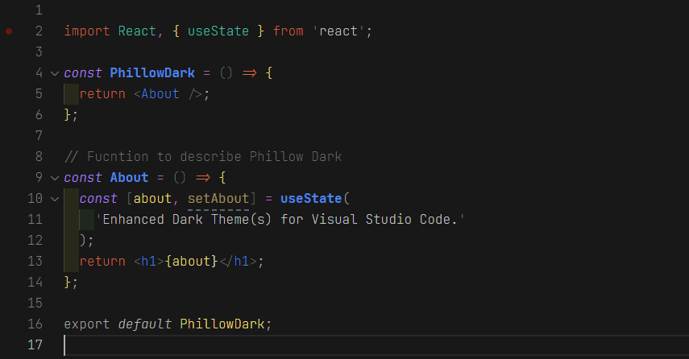

Phillow Dark is an enhanced dark theme designed to improve the overall development experience.

### Feature Request/Issue

Please [open an issue](https://github.com/philecker/phillow-dark/issues), if you have a feature request, or found a bug to report.

### Supported

* HTML
* CSS
* JavaScript
* JSX
* JSON
* TypeScript (Partial Support)
* Jest (Partial Support)
* Dockerfile (Partial Support)
* Markdown (Partial Support)
* Sass/SCSS (Partial Support)
* Less (Partial Support)
* C# (Partial Support)
* Handlebars (Partial Support)
* Java (Partial Support)
* Python (Partial Support)